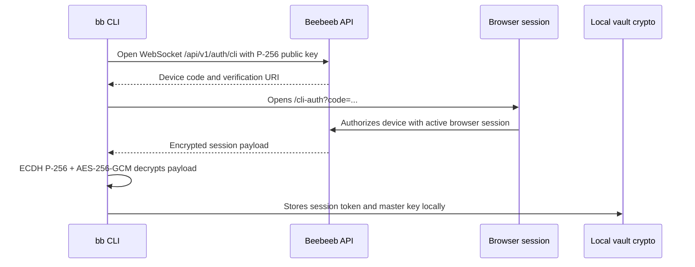

# Beebeeb CLI

`bb` is the command-line client for Beebeeb, an end-to-end encrypted, zero-knowledge cloud storage product made in Europe and operated by Initlabs B.V. (KvK 95157565), Wijchen, Netherlands.

The CLI lets users authenticate from the terminal, upload encrypted files, download and decrypt files, list vault contents, create shares, run folder sync, and expose a local WebDAV or FUSE view of the vault. File encryption happens locally before upload.

Target launch: September 1, 2026.

## Tech Stack

| Area | Technology |
| --- | --- |
| Language | Rust 2024 |
| CLI parser | `clap` |
| Async runtime | Tokio |
| HTTP client | `reqwest` with Rustls |
| WebSocket login | `tokio-tungstenite` |
| Crypto | `beebeeb-core`, plus P-256 ECDH and AES-256-GCM for browser handoff |
| Local config | JSON under the OS config directory |
| Release tooling | `cargo-dist` config in `dist-workspace.toml` |

## Command Naming

The implemented upload/download commands are currently:

```sh
bb push <path>
bb pull <file-id>
```

Some product copy refers to these actions as upload and download. The current source does not define literal `bb upload` or `bb download` aliases.

## Architecture



File operations require `bb login` first. The login flow opens a browser and uses an OAuth-style device authorization flow backed by ECDH P-256 and AES-256-GCM for the CLI handoff. File encryption uses the same Beebeeb core crypto model as the other clients.

## Prerequisites

- Rust stable with edition 2024 support.
- Cargo.
- A browser for `bb login`.
- Network access to the configured Beebeeb API.
- Optional for `bb mount`: macFUSE on macOS or libfuse3 on Linux, plus the `fuse` feature.

## Installation

Release installer:

```sh
curl -fsSL https://releases.beebeeb.io/cli/install.sh | sh
```

Homebrew release flow is configured for:

```sh
brew install beebeeb-io/tap/bb
```

Build from source:

```sh
git clone https://github.com/beebeeb-io/cli.git
cd cli
cargo build --release
```

The binary is written to `target/release/bb`.

## Quick Start

```sh
bb login
bb push ./report.pdf
bb ls
bb pull <file-id> --output ./report.pdf
```

Useful commands:

```sh
bb whoami
bb status
bb quota
bb config
bb share <file-id>
bb shares
bb unshare <share-id>
bb watch ./folder
bb sync ./folder /Documents
bb webdav --port 7878
bb logout
```

`bb rotate` is present in the command tree but currently prints that key rotation is not implemented.

## Build for Production

Standard release build:

```sh
cargo build --release
```

Optional FUSE-enabled build:

```sh
cargo build --release --features fuse
```

Release metadata and target platforms are defined in `dist-workspace.toml`. Release binaries target macOS and Linux, including musl Linux targets for static builds.

## Environment Variables and Configuration

The CLI does not require environment variables for normal use. It stores configuration in:

```text
~/.config/beebeeb/config.json
```

On first run, defaults are equivalent to:

```json
{
  "api_url": "https://api.beebeeb.io",
  "session_token": null,
  "email": null,
  "master_key": null
}
```

`session_token` and `master_key` are written after successful `bb login`. Treat this file as sensitive.

For local development, edit `api_url` in the config file to point at a local API, for example:

```json
{
  "api_url": "http://localhost:3001"
}
```

## Tests and Checks

Run tests:

```sh
cargo test
```

Compile check:

```sh
cargo check
```

Lint:

```sh
cargo clippy -- -D warnings
```

Format check:

```sh
cargo fmt -- --check
```

## Repository Layout

| Path | Purpose |
| --- | --- |
| `src/main.rs` | Command tree and dispatch. |
| `src/config.rs` | Config file defaults, load, save, and clear. |
| `src/api.rs` | HTTP and streaming API client. |
| `src/commands/login.rs` | Browser-based CLI authorization flow. |
| `src/commands/push.rs` | Encrypt and upload files or folders. |
| `src/commands/pull.rs` | Download and decrypt files. |
| `src/commands/sync.rs` | Bidirectional folder sync. |
| `src/commands/watch.rs` | Watch local folders and push changes. |
| `src/commands/mount.rs` | Optional FUSE mount implementation. |
| `src/commands/webdav.rs` | Local WebDAV server. |

## Security Notes

- Run `bb login` before file operations.
- The CLI stores a session token and base64 master key locally after login.
- File content and names are encrypted before upload.
- CLI browser authorization uses an ephemeral P-256 keypair and AES-256-GCM encrypted payload delivery.
- Security reports should go to `security@beebeeb.io`.

## License

AGPL-3.0-or-later. See `LICENSE`.
