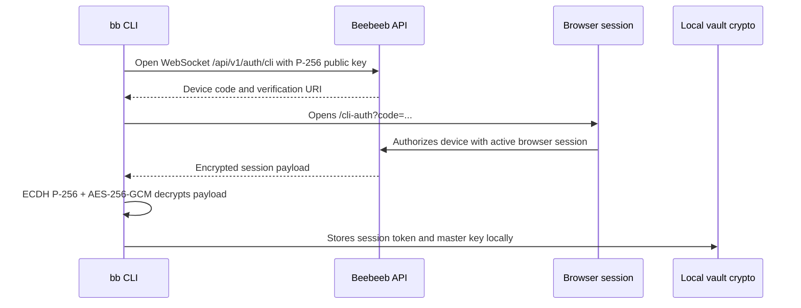

# Beebeeb CLI

[](https://github.com/beebeeb-io/cli/actions/workflows/release.yml)
[](https://github.com/beebeeb-io/cli/releases/latest)
[](LICENSE)

[](https://get.beebeeb.io)

`bb` is the command-line client for [Beebeeb](https://beebeeb.io), an end-to-end encrypted, zero-knowledge cloud storage product made in Europe and operated by Initlabs B.V. (KvK 95157565), Wijchen, Netherlands.

The CLI lets you authenticate from the terminal, upload and download encrypted files, list vault contents, create and revoke share links, run bidirectional folder sync, watch folders for live changes, and expose a local WebDAV view of your vault. All encryption and decryption happens locally -- the server never sees plaintext.

## Install

### Homebrew (macOS / Linux)

```sh
brew install beebeeb-io/tap/bb
```

This is the recommended channel. Homebrew handles updates automatically with `brew upgrade bb`.

### Quick install (Linux, macOS)

```sh
curl -fsSL https://get.beebeeb.io | sh
```

Downloads the latest release tarball, verifies the SHA-256 checksum, and installs `bb` into `$CARGO_HOME/bin` (defaults to `~/.cargo/bin`). Re-run the command to upgrade.

### Direct download (all platforms)

Grab the appropriate archive from [the latest GitHub release](https://github.com/beebeeb-io/cli/releases/latest) and extract `bb` (or `bb.exe`) into a directory on your `PATH`. Available targets:

| Platform | Artifact |
| --- | --- |
| macOS Apple Silicon | `beebeeb-cli-aarch64-apple-darwin.tar.xz` |
| macOS Intel | `beebeeb-cli-x86_64-apple-darwin.tar.xz` |
| Linux x86_64 (musl) | `beebeeb-cli-x86_64-unknown-linux-musl.tar.xz` |
| Linux aarch64 (musl) | `beebeeb-cli-aarch64-unknown-linux-musl.tar.xz` |
| Windows x64 | `beebeeb-cli-x86_64-pc-windows-msvc.zip` |

### Windows (Scoop)

```powershell
scoop install https://raw.githubusercontent.com/beebeeb-io/cli/main/scoop/bb.json
```

### From source

```sh
cargo install --git https://github.com/beebeeb-io/cli
```

Useful for hacking on `bb` itself. Not the recommended install path — the tarball/Homebrew channels are signed via GitHub Releases and don't require a working Rust toolchain.

## Quick Start

```sh
bb login                          # Opens browser for secure handoff
bb push ./report.pdf              # Encrypt and upload
bb ls                             # List vault contents (names decrypted locally)
bb pull Music/notes.md              # Download by path (resolves encrypted names)
bb share <file-id>                # Create a share link
bb sync ~/vault /Documents        # Sync then watch continuously
bb webdav                         # Mount vault in Finder via WebDAV
bb logout                         # End session
```

## Command Reference

### Authentication

#### `bb login`

Authenticate with your Beebeeb account via a browser-based device authorization flow.

```sh
bb login
```

Opens a browser window for you to authorize the CLI. Uses an ephemeral P-256 ECDH keypair so the session token and master key are delivered encrypted -- never exposed in the URL or to the server in transit.

#### `bb logout`

End the current session and clear stored credentials.

```sh
bb logout
```

#### `bb whoami`

Show current session details: email, device, region, and quota.

```sh
bb whoami
```

#### `bb status`

Alias for `bb whoami`.

#### `bb quota`

Show storage quota with color-coded usage bar: used / total / file count.

```sh
bb quota
```

#### `bb config`

Show the current configuration with secrets masked.

```sh
bb config
```

Displays `api_url`, `email`, `session_token` (truncated), `master_key` (hidden), and the config file path.

### File Operations

#### `bb push`

Encrypt and upload a file or folder to your vault.

```sh
bb push <path> [--parent <folder-id>] [--folder <name>] [--replace] [--keep-both]
```

- `--parent <id>` -- upload into a specific folder by UUID
- `--folder <name>` -- upload into a root-level folder by name or ID
- `--replace` -- if a file with the same name exists, overwrite it (creates a new version)
- `--keep-both` -- if a file with the same name exists, upload with a numeric suffix

Aliases: `bb upload`

Examples:

```sh
bb push ./photo.jpg
bb push ./documents/ --folder "Work"
bb push ./report.pdf --replace
```

#### `bb pull`

Download and decrypt a file from your vault. Accepts a vault path or a file UUID.

```sh
bb pull <path-or-id> [-o <output-path>]
```

If no output path is specified, the file is saved with its decrypted original filename in the current directory.

Aliases: `bb download`

Examples:

```sh
bb pull Music/notes.md                        # Download by path
bb pull "Music/Old/My Playlist/track.flac"    # Deep nested path
bb pull 5c3fdcf1-3b0c-4d85-9985-04a8bd3eed93 # By UUID
bb pull 5c3fdcf1-... -o ./report.pdf          # Custom output path
```

#### `bb ls`

List files in the vault. Filenames are decrypted locally.

```sh
bb ls [path-or-folder-id]
```

Displays a table with name, size, modified date, and short ID. Folders are shown with a trailing `/`.

Examples:

```sh
bb ls                    # List root
bb ls Music/             # List by folder name
bb ls Music/Old          # Nested path
bb ls 6c71debc-...       # By UUID
```

### Sharing

#### `bb share`

Create an encrypted share link for a file.

```sh
bb share <file-id> [--expires <duration>] [--max-opens <n>] [--passphrase] [--double-encrypted]
```

- `--expires <duration>` -- link expiry as hours (`24`) or a duration string (`7d`, `1h`)
- `--max-opens <n>` -- maximum number of times the link can be opened
- `--passphrase` -- prompt for a passphrase (minimum 12 characters) to protect the link with Argon2id
- `--double-encrypted` -- client wraps the file key so the server cannot decrypt; the decryption key goes in the URL fragment (never sent to the server)

Examples:

```sh
bb share 5c3fdcf1-... --expires 7d --max-opens 5
bb share 5c3fdcf1-... --double-encrypted
bb share 5c3fdcf1-... --passphrase --expires 24h
```

#### `bb shares`

List all active share links with file name, URL, expiry, and open count.

```sh
bb shares
```

#### `bb unshare`

Revoke a share link. Without arguments, shows an interactive picker.

```sh
bb unshare               # Interactive: arrow keys to select, Enter to confirm
bb unshare <share-id>    # Direct revocation by ID (for scripting)
```

### Sync

#### `bb sync`

Bidirectionally sync a local folder with a remote vault path. By default, after the initial sync completes, `bb sync` continues watching for changes in real time (filesystem notifications + SSE remote events).

```sh
bb sync <local-dir> <remote-path> [--once] [--daemon] [--stop] [--dry-run] [--force] [--delete]
```

- `<remote-path>` -- vault path like `/Documents` or `/Work/Reports`. Created automatically if it does not exist. After first sync, the remote path is stored in `.bb-sync.json` and can be omitted.
- `--once` -- run a single sync pass and exit (no continuous watching)
- `--daemon` -- install as a login daemon (launchd on macOS, systemd on Linux) and exit
- `--stop` -- remove a previously installed daemon
- `--dry-run` -- show what would change without making any modifications
- `--force` -- resolve conflicts by overwriting the remote copy with the local one (local wins)
- `--delete` -- trash remote files that no longer exist locally. Without this flag, remotely-orphaned files are reported but not deleted.

Sync logic:

- Files only on one side are copied to the other (upload or download).
- Files changed on one side since last sync are propagated to the other.
- Files changed on both sides since last sync are flagged as conflicts and skipped unless `--force` is used.
- Hidden files (names starting with `.`) are excluded.

Uses a `.bb-sync.json` state file in the local folder to track which files have been synced, their last modification time, and their remote UUIDs. This file is created automatically on first sync.

Examples:

```sh
bb sync ~/Documents /Documents           # Sync then watch continuously
bb sync ~/Documents /Documents --once    # One-shot sync, then exit
bb sync ~/Documents --dry-run            # Preview changes
bb sync --daemon ~/Documents /Documents  # Install as login daemon
bb sync --stop                           # Remove the daemon
bb sync ~/work /Work --force --delete
```

Press Ctrl+C to stop continuous mode.

#### `bb watch` (deprecated)

Alias for `bb sync`. Use `bb sync` instead.

### WebDAV

Serve your vault as a local WebDAV server. This lets you browse and edit encrypted files through Finder, Explorer, rclone, Cyberduck, or any WebDAV client -- files are decrypted in memory on the fly, never written to disk in plaintext.

```sh
bb webdav [--port <port>] [--read-only] [--cache-ttl <seconds>] [--no-cache] [--verbose]
```

- `--port <port>` -- TCP port to listen on (default: 7878)
- `--read-only` -- block all write operations (PUT, DELETE, MKCOL, MOVE)
- `--cache-ttl <seconds>` -- directory listing cache TTL (default: 30)
- `--no-cache` -- disable the directory listing cache entirely
- `--verbose` -- log every WebDAV request (method, path, status, duration)

Supported WebDAV methods:

| Method | Description |
| --- | --- |
| OPTIONS | Announces DAV class 1+2 compliance |
| PROPFIND | List files with decrypted names, ETags, timestamps |
| GET | Download and decrypt a file |
| HEAD | File metadata (size, ETag, Last-Modified) |
| PUT | Encrypt and upload (supports If-Match for optimistic locking) |
| MKCOL | Create an encrypted folder |
| DELETE | Soft-delete (trash) a file or folder |
| MOVE | Rename or move a file/folder |
| LOCK/UNLOCK | Stub implementation for Finder/LibreOffice compatibility |

Connecting from Finder (macOS):

1. Start the server: `bb webdav`
2. In Finder: Go > Connect to Server (Cmd+K)
3. Enter `http://localhost:7878`
4. Browse your vault as a regular folder

The WebDAV server automatically filters macOS and Windows metadata files (`.DS_Store`, `Thumbs.db`, `._*` resource forks, Spotlight indexes) so they are never uploaded to your vault.

Caveats:

- Files are decrypted in memory, not on disk. Large files consume RAM proportional to their size.
- The server listens on localhost only -- it is not exposed to the network.
- LOCK/UNLOCK are stubs for client compatibility; there is no distributed lock coordination.

### FUSE Mount

Mount your vault as a filesystem (requires macFUSE on macOS or libfuse3 on Linux).

```sh
bb mount <mountpoint> [--foreground] [--cache-ttl <seconds>]
bb unmount <mountpoint>
```

- `--foreground` -- stay in foreground instead of daemonizing
- `--cache-ttl <seconds>` -- cache TTL for directory listings (default: 30, 0 = no cache)

Requires building with the `fuse` feature:

```sh
cargo build --release --features fuse
```

### Utilities

#### `bb completions`

Print a shell completion script to stdout.

```sh
bb completions <shell>
```

Supported shells: `bash`, `zsh`, `fish`, `powershell`.

Install completions:

```sh
bb completions bash > ~/.local/share/bash-completion/completions/bb
bb completions zsh > ~/.zfunc/_bb
bb completions fish > ~/.config/fish/completions/bb.fish
bb completions powershell > ~/Documents/PowerShell/completions/bb.ps1
```

### Global Options

- `--api <URL>` -- override the API base URL for a single command. During `bb login`, this is persisted to the config file for future commands.

## Security Model

Beebeeb uses a zero-knowledge architecture. The server stores only ciphertext -- it cannot decrypt file contents, filenames, or share link payloads.

**Key derivation.** Your master key is derived during login and stored locally. It never leaves your device and is never sent to the server. Per-file encryption keys are derived from the master key using HKDF with the file's UUID as context, so each file has a unique key.

**Encryption.** All file content and filenames are encrypted with AES-256-GCM before upload. Files are split into 1 MB chunks (4 MB for WebDAV uploads), each encrypted independently with its own nonce. Filenames are encrypted as metadata blobs with the same scheme.

**Authentication.** The CLI login flow uses an ephemeral P-256 ECDH keypair. The browser session authorizes the device, and the server delivers the session payload encrypted under the shared ECDH secret using AES-256-GCM. The CLI decrypts locally, so the session token and master key are never exposed in transit.

**Session storage.** After login, the session token and base64-encoded master key are stored in:

```
~/Library/Application Support/beebeeb/config.json   # macOS
~/.config/beebeeb/config.json                        # Linux
```

This file is sensitive -- treat it like an SSH private key. Sessions expire after 30 days.

**Share links.** Standard share links include the file key in the URL. Double-encrypted shares (`--double-encrypted`) generate a client-side key K_c, wrap the file key under it, and place K_c in the URL fragment (after `#`), which is never sent to the server. Passphrase-protected shares wrap the file key with Argon2id-derived key material.

**Cross-client compatibility.** The CLI handles files encrypted by other Beebeeb clients (web, mobile). It supports both the CLI-native EncryptedBlob format and the web app's base64 blob format, and both UUID key derivation methods (binary and string), so all files are readable regardless of which client uploaded them.

## Architecture



## Tech Stack

| Area | Technology |
| --- | --- |
| Language | Rust 2024 |
| CLI parser | `clap` with derive macros |
| Async runtime | Tokio |
| HTTP client | `reqwest` with Rustls |
| WebSocket login | `tokio-tungstenite` |
| Crypto | `beebeeb-core` (AES-256-GCM, HKDF, P-256 ECDH) |
| WebDAV server | `axum` |
| File watching | `notify` (FSEvents/inotify) |
| Local config | JSON under the OS config directory |
| Release tooling | `cargo-dist` config in `dist-workspace.toml` |

## Configuration

The CLI stores configuration at the OS-appropriate config directory:

```
~/Library/Application Support/beebeeb/config.json   # macOS
~/.config/beebeeb/config.json                        # Linux
```

On first run (before login), defaults are:

```json
{
  "api_url": "https://api.beebeeb.io",
  "session_token": null,
  "email": null,
  "master_key": null
}
```

After `bb login`, `session_token`, `email`, and `master_key` are populated. Treat this file as sensitive.

For local development, edit `api_url` to point at a local API:

```json
{
  "api_url": "http://localhost:3001"
}
```

Or use the `--api` flag for a single command:

```sh
bb --api http://localhost:3001 ls
```

## Prerequisites

- Rust stable with edition 2024 support
- A browser for `bb login`
- Network access to the Beebeeb API
- Optional: macFUSE (macOS) or libfuse3 (Linux) for `bb mount`

## Build

```sh
cargo build --release                  # Standard build
cargo build --release --features fuse  # With FUSE support
cargo test
cargo clippy -- -D warnings
cargo fmt -- --check
```

## Repository Layout

| Path | Purpose |
| --- | --- |
| `src/main.rs` | Command tree (clap) and dispatch |
| `src/config.rs` | Config file: load, save, clear, defaults |
| `src/api.rs` | HTTP and streaming API client |
| `src/crypto.rs` | Cross-client decryption (CLI + web app formats) |
| `src/path.rs` | Shared path resolution with LRU cache |
| `src/ui.rs` | Terminal UI helpers (colors, bars, boxes) |
| `src/update.rs` | OTA self-update with Homebrew support |
| `src/colors.rs` | Terminal color constants (amber, green, red) |
| `src/loopback.rs` | Localhost loopback utilities |
| `src/commands/login.rs` | Browser-based CLI authorization flow |
| `src/commands/push.rs` | Encrypt and upload files or folders |
| `src/commands/pull.rs` | Download and decrypt files |
| `src/commands/ls.rs` | List vault contents with decrypted names |
| `src/commands/share.rs` | Create, list, and revoke share links |
| `src/commands/sync.rs` | Bidirectional folder sync |
| `src/commands/watch.rs` | Filesystem watcher with live sync |
| `src/commands/watch_remote.rs` | SSE consumer for remote change events |
| `src/commands/webdav.rs` | Local WebDAV server |
| `src/commands/mount.rs` | FUSE mount implementation |
| `src/commands/quota.rs` | Storage quota display |
| `src/commands/status.rs` | Connection and session status |
| `src/commands/whoami.rs` | Session identity display |
| `src/commands/config.rs` | Configuration display |
| `src/commands/logout.rs` | Session teardown |

## License

AGPL-3.0-or-later. See `LICENSE`.

## Security Reports

Report vulnerabilities to `security@beebeeb.io`.
