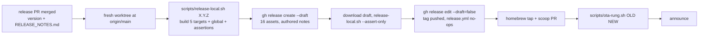

# Release checklist

## Prerequisites (one-time setup)

1. **Homebrew tap** — create `github.com/beebeeb-io/homebrew-tap` (empty repo, `main` branch).
2. **HOMEBREW_TAP_TOKEN** — create a GitHub PAT with `contents: write` on `homebrew-tap`.
   Add it to `github.com/beebeeb-io/cli → Settings → Secrets → HOMEBREW_TAP_TOKEN`.
3. **Scoop manifest** — lives in *this* repo at `scoop/bb.json` (no separate bucket repo —
   `beebeeb-io/scoop-bucket` doesn't exist). The release workflow keeps it current automatically
   (see step 5 below); there is no one-time setup for it.
4. **`ci/release-pipeline-fixes` prerequisite (task 1497):** the release workflow's
   `open-scoop-manifest-pr` job needs the repo setting **Settings → Actions → General → Workflow
   permissions → "Allow GitHub Actions to create and approve pull requests"** enabled, or its
   `gh pr create` step fails (GITHUB_TOKEN is blocked from opening PRs otherwise, independent of
   the `pull-requests: write` job permission). Verified via `gh api repos/beebeeb-io/cli
   --jq .permissions` returning `can_approve_pull_request_reviews: false` as of this writing —
   flip it before relying on the automated Scoop PR.

## Cutting a release

> This is the CI-driven path. Without Actions minutes, use **Local release** below instead.

```bash
# 1. Bump version in Cargo.toml
#    Change: version = "0.1.0"  →  version = "1.0.0"
vim Cargo.toml

# 2. Update Cargo.lock
cargo check

# 3. Author RELEASE_NOTES.md at the repo root for the exact version being cut
#    (intro → What's New → Bug Fixes/Hardening → Verification → Install/Update →
#    changelog link — see the workspace CLAUDE.md "Release notes" section for the
#    canonical format). scripts/check-release-notes.sh gates this file TWICE:
#    first as the opening step of the `plan` job, on the tag push itself, BEFORE
#    anything is built or the GitHub Release is even created — a missing or
#    stale RELEASE_NOTES.md stops the whole pipeline right there — and again in
#    `set-release-notes` right before it overwrites the release body. There is
#    no silent fallback to the auto-generated changelog body.
vim RELEASE_NOTES.md

# 4. Verify the release plan looks right (no build — dry run)
dist plan

# 5. Commit + tag
git add Cargo.toml Cargo.lock RELEASE_NOTES.md CHANGELOG.md
git commit -m "chore: release v1.0.0"
git tag v1.0.0
git push && git push --tags

# → GitHub Actions fires automatically on the tag push:
#   - `plan` job's FIRST step re-validates RELEASE_NOTES.md against the tag's exact
#     version — fails closed before anything is built or the release is created
#   - Builds binaries for 5 targets (macOS arm64+x86, Linux arm64+x86, Windows x86)
#   - Creates GitHub Release with all archives + SHA-256 checksums
#   - Overwrites the release body with the authored RELEASE_NOTES.md (`set-release-notes` job;
#     re-validates + fails loudly if RELEASE_NOTES.md is missing/stale, but never blocks the
#     two jobs below — by this point the plan-job gate has already proven it's fine)
#   - Opens a PR (branch `release/scoop-v1.0.0`) bumping `scoop/bb.json` to the new
#     version + Windows artifact SHA-256 (`open-scoop-manifest-pr` job) — review and
#     merge it manually; it no longer pushes straight to `main` (that used to fail
#     GH006 on the protected branch and, worse, could take the whole `host` job down
#     with it — see task 1497)
#   - Pushes bb.rb formula to beebeeb-io/homebrew-tap
#   - Publishes beebeeb-cli-installer.sh (curl | sh target)
```

## Local release (when GitHub Actions minutes are unavailable)

0.13.0, 0.13.1 and 0.13.2 were cut from a Mac. This is the committed procedure; every
step that bit us has a script assertion behind it. Tracked in task 1839.



**Prerequisites on the build Mac:** `dist` 0.31.0, `jq`, `gh` (authenticated), `cargo-xwin`,
`cargo-zigbuild`, `zig`, Homebrew `llvm@21` (`brew install llvm@21`). The Windows target
cross-compiles via cargo-xwin and needs `llvm@21`'s `clang-cl` with `-msse4.1` for libwebp;
`scripts/clang-cl-sse4.sh` is that wrapper and `release-local.sh` puts it on `PATH` for the Windows
build only. Nothing to patch by hand.

1. **Release PR.** Bump `Cargo.toml` + `Cargo.lock`, author `RELEASE_NOTES.md` for the exact version
   (intro, `### What's New`, `### Bug Fixes / Hardening`, `### Verification`, install/update note,
   changelog link last; see the workspace CLAUDE.md "Release notes" section). Merge to `main`.
2. **Build + assert, from a fresh worktree** (never the primary checkout; the script refuses a dirty tree):

   ```bash
   git worktree add ~/code/bb-worktrees/cli-X.Y.Z -b release/X.Y.Z origin/main
   cd ~/code/bb-worktrees/cli-X.Y.Z
   scripts/release-local.sh X.Y.Z 2>&1 | tee release-local.log
   ```

   It builds the 5 local targets and the global artifacts, regenerates `dist-manifest.json`
   (`--no-local-paths`), **injects `checksums.sha256` for every archive** (a locally generated
   manifest has none; `src/update.rs` then refuses to update, silently), **adds the `sha256` lines
   to `bb.rb`** (dist omits them locally), updates `scoop/bb.json` from the Windows zip's `.sha256`,
   and then asserts:

   - exactly the 16 expected assets, no strays;
   - for each of the 5 archives and `source.tar.gz`: manifest `checksums.sha256` == file == `.sha256` sidecar;
   - `bb.rb`: 4 of 4 `url` lines have a `sha256` equal to the file;
   - `scoop/bb.json`: version, URL and hash equal the Windows zip;
   - manifest `announcement_tag` is `vX.Y.Z` and carries no build-host paths.

   Any failure exits non-zero with `do NOT publish`. Do not hand-patch around a red; fix the cause.
   `scripts/release-local.sh X.Y.Z --assert-only <dir>` re-runs only the assertions on a directory
   of assets (a `gh release download` of a published or draft release).
3. **Draft release** with the authored notes (never the auto-generated body). The script prints the
   exact 16-file upload set:

   ```bash
   gh release create vX.Y.Z --draft --target "$(git rev-parse HEAD)" --title "bb X.Y.Z" \
     --notes-file RELEASE_NOTES.md <the 16 files listed by release-local.sh>
   ```

4. **Verify the draft.** Download its assets into a scratch dir and run
   `scripts/release-local.sh X.Y.Z --assert-only <dir>` again: what GitHub holds is what you asserted.
   Run the macOS binary from the archive with `HOME=<scratch>` (`bb --version`).
5. **Publish** (`gh release edit vX.Y.Z --draft=false`). Publishing creates the tag, which fires
   `release.yml` on the tag push. Its `plan` job detects the existing release with assets
   (`scripts/release-exists.sh`) and every build, host, upload, tap and scoop job is skipped, so it
   cannot rebuild or overwrite the real assets. Check `gh run list --workflow release.yml --limit 3`:
   the run should show `plan` green and everything else skipped. If it ever starts building, cancel it.
   When no release exists for a pushed tag (the normal CI-driven path) nothing changes.
6. **Homebrew tap.** Copy the published `bb.rb` to `Formula/bb.rb` in `beebeeb-io/homebrew-tap`,
   commit `bb X.Y.Z`, push. (CI's `publish-homebrew-formula` job is skipped on a local release.)
7. **Scoop.** Commit the `scoop/bb.json` that `release-local.sh` updated and open a PR to `main`
   (CI's `open-scoop-manifest-pr` is skipped on a local release too).
8. **OTA rung, before announcing.** The only thing that proves self-update works is running the old
   binary against the published release:

   ```bash
   scripts/ota-rung.sh OLD X.Y.Z      # e.g. scripts/ota-rung.sh 0.13.1 0.13.2
   ```

   It waits until the plain `dist-manifest.json` download URL serves the published bytes (GitHub's
   release CDN keeps serving the old object for a while after a `--clobber` re-upload; 0.13.2 took
   ~90 s) and `releases/latest` is `vX.Y.Z`, downloads the old binary for this host into a mktemp dir,
   runs it with `HOME=<scratch>` on **every** invocation, and asserts the `Updating bb vOLD -> vX.Y.Z`
   line, that `--version` reports the new version afterwards, and that the binary on disk is
   byte-identical to the new release archive's `bb`. Never run a `bb` login/upload rung with the real
   `HOME`: the global config holds a live session and master key.
9. **Evidence.** Keep `release-local.log`, the draft download assertion, the `ota-rung.sh` output and
   the run list in the task's `verification-evidence/` folder.

Tests for these scripts: `scripts/update-scoop-manifest.test.sh`, `scripts/release-exists.test.sh`,
`scripts/release-workflow.test.sh` (each is red against the old behaviour; run them after touching a script).

## Installation methods (post-release)

```bash
# macOS / Linux — shell installer
curl -sSf https://get.beebeeb.io | sh

# macOS — Homebrew
brew install beebeeb-io/tap/bb

# Windows — Scoop (bb.json lives in this repo, not a separate bucket)
scoop install https://raw.githubusercontent.com/beebeeb-io/cli/main/scoop/bb.json

# Direct download (all platforms)
# https://github.com/beebeeb-io/cli/releases/latest
```

## Shell completions (add to install docs / post-install note)

After installing `bb`, users can enable tab-completion for their shell:

```bash
# Bash (add to ~/.bashrc or drop in the completions dir)
bb completions bash > ~/.local/share/bash-completion/completions/bb
# or: echo 'eval "$(bb completions bash)"' >> ~/.bashrc

# Zsh (add the directory to fpath first)
mkdir -p ~/.zfunc
bb completions zsh > ~/.zfunc/_bb
# In ~/.zshrc, before compinit: fpath=(~/.zfunc $fpath)

# Fish
bb completions fish > ~/.config/fish/completions/bb.fish

# PowerShell
bb completions powershell > ~/Documents/PowerShell/completions/bb.ps1
# Then source it in $PROFILE: . ~/Documents/PowerShell/completions/bb.ps1

# Homebrew tap users get completions automatically via brew's linkage.
```

Include this block in:
- The docs site CLI quick-start article (after the install step)
- The Homebrew formula's `caveats` string (if added later)

## Rollback

```bash
# Delete the tag locally and remotely (aborts the release)
git tag -d v1.0.0
git push origin :refs/tags/v1.0.0

# If the GitHub Release was already created, delete it via:
gh release delete v1.0.0 --yes
```
